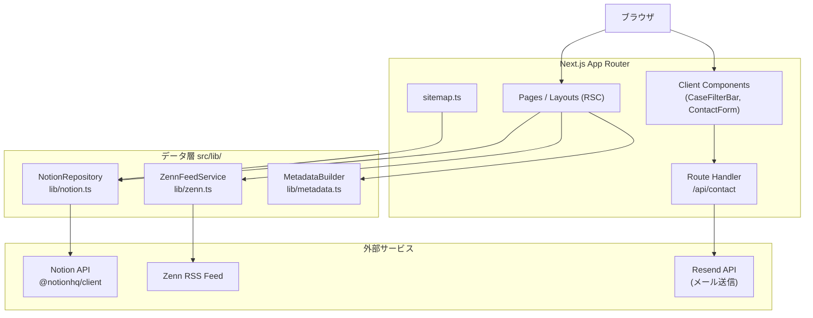
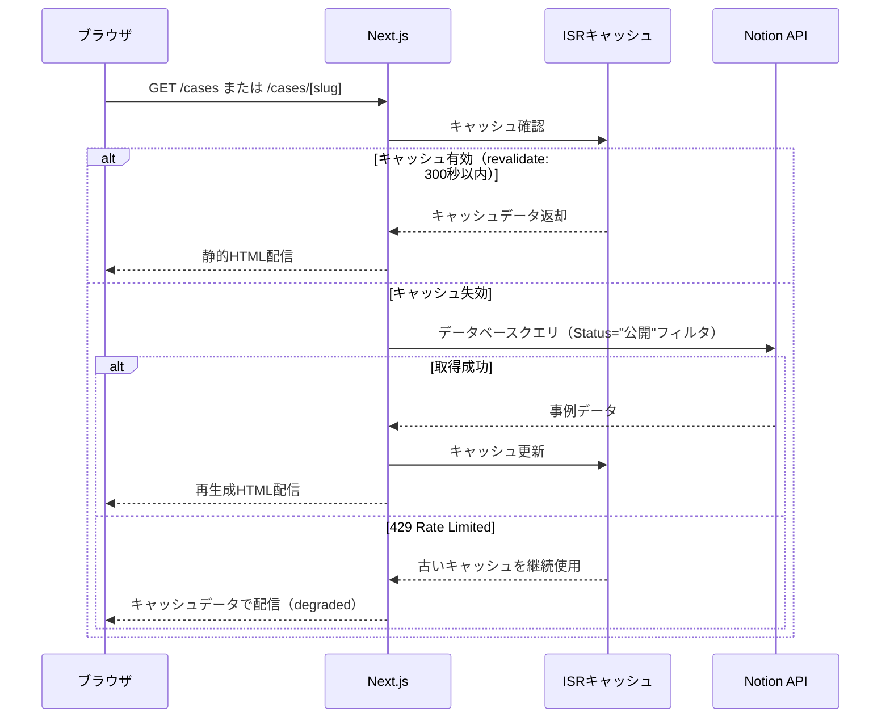
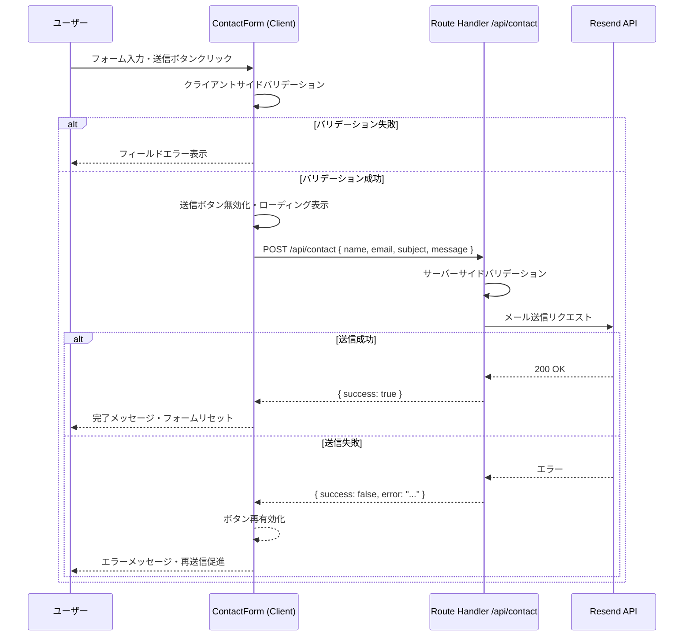
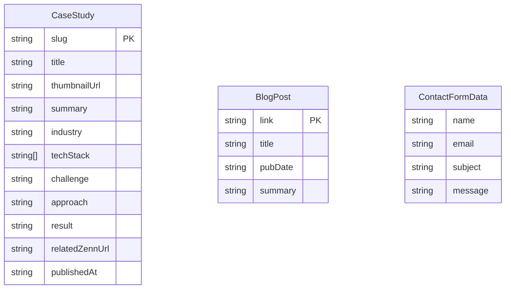

# 技術設計ドキュメント: engineer-portfolio

## 概要

本フィーチャーは、エンジニアのポートフォリオサイト **toge** を実装する。潜在クライアントに対して「課題解決ストーリー」軸の事例を届け、信頼構築・案件獲得を目的とする。

**対象ユーザー**: 潜在クライアント（発注検討者）・技術評価者（採用担当・エンジニア）・コンテンツ管理者（サイトオーナー）。

**システムへの影響**: 既存の空実装（`src/app/page.tsx`）を置き換え、5ページ構成のサイトを新規構築する。NotionをCMS、ZennをブログプラットフォームとしてRSS経由で連携する。

### ゴール

- 30秒以内に専門性と提供価値が伝わるトップページを実装する
- Notionから事例データを取得してISRで配信する（5分キャッシュ）
- Zenn RSSフィードをキャッシュ付きで取得して記事一覧を表示する（1時間キャッシュ）
- お問い合わせフォームからResend経由でメール送信する
- Core Web Vitals良好スコアを達成するRSCファーストの設計とする

### 非ゴール

- Notionデータのリアルタイム同期（Webhookによる即時再ビルドは対象外）
- スパム対策のreCAPTCHA実装（初期リリースでは対象外）
- 多言語対応（日本語のみ）
- 認証・ユーザー管理機能

---

## アーキテクチャ

### アーキテクチャパターンとバウンダリマップ

**選定パターン**: RSCファースト + データ層抽象化（Repository Pattern）

- Server Componentsをページの主体とし、インタラクティブ部分のみClient Componentとして分離
- 外部サービス（Notion API / Zenn RSS / Resend）へのアクセスを `src/lib/` の抽象層に集約
- ステアリングの「RSCファーストの設計」「App Router採用」に完全準拠



**バウンダリの分離方針**:
- `src/lib/` はフレームワーク非依存のデータアクセス層。テスト時はここをモック可能。
- `src/components/` はUIロジックのみを持ち、外部APIを直接呼び出さない。
- `src/app/` のページはデータフェッチと `components/` の組み合わせに専念する。

### テクノロジースタック

| レイヤー | 選定 / バージョン | フィーチャーにおける役割 | 備考 |
|---------|-----------------|----------------------|------|
| Frontend | Next.js 16.2.2 (App Router) / React 19 | ページルーティング・RSC・ISR | ステアリング準拠 |
| Styling | Tailwind CSS v4 + shadcn/ui | コンポーネントスタイリング | `cn()` ユーティリティ経由 |
| Icons | lucide-react v1.7.0 | UIアイコン | ステアリング準拠 |
| CMS連携 | `@notionhq/client` v5.15.0 | Notion APIクライアント | 新規依存関係 |
| RSSパース | `rss-parser` (最新版) | Zenn RSSフィードの取得・パース | 新規依存関係 |
| メール送信 | `resend` SDK (最新版) | お問い合わせメール送信 | 新規依存関係 |
| 型安全 | TypeScript 5 (strict mode) | 全レイヤーの型定義 | `any` 禁止 |

> 詳細な選定根拠・トレードオフは `research.md` のリサーチログを参照。

---

## システムフロー

### 事例データ取得フロー（ISR）



**フロー設計のポイント**: Notionレートリミット到達時もキャッシュ継続配信で可用性を維持（要件 6.3）。

### コンタクトフォーム送信フロー



---

## 要件トレーサビリティ

| 要件 | 概要 | 対応コンポーネント | インターフェース | フロー |
|-----|------|-----------------|----------------|--------|
| 1.1 | キャッチコピー・サブコピー表示 | HeroSection | — | — |
| 1.2 | スキル概要セクション | SkillsSection | — | — |
| 1.3 | ナビゲーション導線 | Header, Navigation | — | — |
| 1.4 | トップページのHTMLメタ情報 | `app/page.tsx` metadata | MetadataBuilder | — |
| 1.5 | 代表事例3件ハイライト | FeaturedCases | NotionRepository | — |
| 2.1 | 事例カード一覧表示 | CaseGrid, CaseCard | NotionRepository | 事例取得フロー |
| 2.2 | カードクリックで詳細へ遷移 | CaseCard | — | — |
| 2.3 | Notion取得失敗時エラー表示 | CaseGrid | NotionRepository | 事例取得フロー |
| 2.4 | 業種・技術でフィルタリング | CaseFilterBar | — | — |
| 2.5 | フィルタ条件に合致する事例のみ表示 | CaseFilterBar | — | — |
| 2.6 | 事例一覧のメタ情報 | `app/cases/page.tsx` metadata | MetadataBuilder | — |
| 3.1 | Before/アプローチ/Afterコンテンツ表示 | CaseDetailContent | NotionRepository | — |
| 3.2 | 技術スタック表示 | TechStackBadge | — | — |
| 3.3 | 関連Zenn記事リンク表示（条件付き） | RelatedZennLink | — | — |
| 3.4 | 関連Zenn記事を新タブで開く | RelatedZennLink | — | — |
| 3.5 | 固有URLスラッグの静的ルート生成 | `app/cases/[slug]/page.tsx` | NotionRepository | — |
| 3.6 | 事例詳細ページのメタ情報 | `app/cases/[slug]/page.tsx` metadata | MetadataBuilder | — |
| 3.7 | 存在しないスラッグへの404表示 | `notFound()` | — | — |
| 4.1 | Zenn RSS記事一覧表示 | BlogPostList, BlogPostCard | ZennFeedService | — |
| 4.2 | 公開日降順で表示 | BlogPostList | ZennFeedService | — |
| 4.3 | RSS取得失敗時フォールバック | BlogFallback | ZennFeedService | — |
| 4.4 | 記事クリックで新タブ開く | BlogPostCard | — | — |
| 4.5 | ブログを独立ルートで提供 | `app/blog/page.tsx` | — | — |
| 4.6 | RSSキャッシュ1時間 | ZennFeedService | ZennFeedService | — |
| 5.1 | 入力フォーム（氏名・メール・件名・本文） | ContactForm | ContactFormSchema | コンタクトフロー |
| 5.2 | 必須バリデーション | ContactForm | ContactFormSchema | コンタクトフロー |
| 5.3 | バリデーション失敗時エラー表示・送信阻止 | ContactForm | — | コンタクトフロー |
| 5.4 | メール形式エラー表示 | ContactForm | ContactFormSchema | — |
| 5.5 | 送信完了メッセージ・フォームリセット | ContactForm | ContactService | コンタクトフロー |
| 5.6 | 送信エラー時の再送信促進 | ContactForm | ContactService | コンタクトフロー |
| 5.7 | 送信中のボタン無効化・ローディング | ContactForm | — | コンタクトフロー |
| 6.1 | Notion APIで事例データ取得 | NotionRepository | NotionRepository | 事例取得フロー |
| 6.2 | ISRキャッシュによるパフォーマンス最適化 | `app/cases/*` pages | — | 事例取得フロー |
| 6.3 | レートリミット時にキャッシュ継続利用 | NotionRepository | — | 事例取得フロー |
| 6.4 | 「公開」ステータスの事例のみ表示 | NotionRepository | — | — |
| 6.5 | スキーマ不正時エラーログ・スキップ | NotionRepository | — | — |
| 7.1 | 全ページレスポンシブレイアウト | 全コンポーネント | — | — |
| 7.2 | モバイルのハンバーガーメニュー | MobileNavigation | — | — |
| 7.3 | タッチデバイス対応 | 全インタラクティブ要素 | — | — |
| 7.4 | レスポンシブ画像最適化 | Next.js Image コンポーネント | — | — |
| 8.1 | 全ページtitle/meta description設定 | MetadataBuilder | MetadataBuilder | — |
| 8.2 | 全ページOGPタグ設定 | MetadataBuilder | MetadataBuilder | — |
| 8.3 | sitemap.xml生成 | `app/sitemap.ts` | NotionRepository | — |
| 8.4 | Core Web Vitals良好スコア | RSC設計・画像最適化 | — | — |
| 8.5 | Next.js Imageコンポーネントによる画像最適化 | 全画像コンポーネント | — | — |

---

## コンポーネントとインターフェース

### コンポーネントサマリー

| コンポーネント | ドメイン/レイヤー | 目的 | 要件カバレッジ | 主要依存関係 | コントラクト |
|-------------|----------------|------|-------------|------------|------------|
| NotionRepository | lib / データ層 | Notion APIクライアントラッパー | 2.1, 2.3, 3.1, 3.5, 6.1-6.5 | `@notionhq/client` (P0) | Service |
| ZennFeedService | lib / データ層 | Zenn RSSフェッチ・パース | 4.1, 4.2, 4.3, 4.6 | `rss-parser` (P0) | Service |
| ContactService | lib / データ層 | Resend経由メール送信 | 5.5, 5.6 | `resend` SDK (P0) | Service, API |
| MetadataBuilder | lib / ユーティリティ | ページmetadata生成 | 1.4, 2.6, 3.6, 8.1, 8.2 | — | Service |
| Header | components/layout | グローバルナビゲーション | 1.3, 7.1-7.3 | Navigation, MobileNavigation (P0) | — |
| Navigation | components/layout | デスクトップナビ | 1.3 | — | — |
| MobileNavigation | components/layout | モバイルハンバーガーメニュー | 7.2, 7.3 | — | State |
| HeroSection | components/top | キャッチコピー・サブコピー表示 | 1.1 | — | — |
| SkillsSection | components/top | スキル概要表示 | 1.2 | — | — |
| FeaturedCases | components/top | 代表事例3件ハイライト | 1.5 | NotionRepository (P0) | — |
| CaseCard | components/cases | 事例カード（サムネイル・タイトル・概要） | 2.1, 2.2 | — | — |
| CaseGrid | components/cases | 事例カード一覧 + エラー境界 | 2.1, 2.3 | CaseCard (P0) | — |
| CaseFilterBar | components/cases | 業種・技術フィルタUI（Client） | 2.4, 2.5 | — | State |
| CaseDetailContent | components/cases | Before/アプローチ/After表示 | 3.1, 3.2, 3.3, 3.4 | TechStackBadge (P1), RelatedZennLink (P1) | — |
| BlogPostCard | components/blog | ブログ記事カード | 4.1, 4.4 | — | — |
| BlogPostList | components/blog | 記事一覧 + フォールバック | 4.1-4.3 | BlogPostCard (P0), BlogFallback (P1) | — |
| ContactForm | components/contact | お問い合わせフォーム（Client） | 5.1-5.7 | `/api/contact` Route Handler (P0) | State |

---

### データ層 (src/lib/)

#### NotionRepository

| フィールド | 詳細 |
|-----------|------|
| 目的 | Notion APIへのアクセスを抽象化し、型安全な事例データを提供する |
| 要件 | 2.1, 2.3, 3.1, 3.5, 6.1-6.5 |

**責任と制約**
- Notion APIクライアント初期化と認証（環境変数 `NOTION_API_KEY`, `NOTION_DATABASE_ID`）の管理
- 「公開」ステータスのページのみクエリ（要件 6.4）
- Notionプロパティの型ごとに安全なマッピングを行い、不正フィールドはスキップ（要件 6.5）
- ISRキャッシュはNext.jsの `fetch` + `next: { revalidate: 300 }` で制御（要件 6.2）

**依存関係**
- 外部: `@notionhq/client` v5.15.0 — Notion APIアクセス (P0)

**コントラクト**: Service [x]

##### サービスインターフェース

```typescript
interface CaseStudy {
  id: string;
  slug: string;
  title: string;
  thumbnailUrl: string | null;
  summary: string;
  industry: string;
  techStack: string[];
  challenge: string;
  approach: string;
  result: string;
  relatedZennUrl: string | null;
  publishedAt: string;
}

interface NotionRepositoryService {
  getCaseStudies(): Promise<CaseStudy[]>;
  getCaseStudyBySlug(slug: string): Promise<CaseStudy | null>;
  getAllSlugs(): Promise<string[]>;
}
```

- **前提条件**: `NOTION_API_KEY` と `NOTION_DATABASE_ID` が環境変数に設定されていること
- **事後条件**: 「公開」ステータスの事例のみを返す。スキーマ不正エントリはスキップして他を返す
- **不変条件**: `slug` はNotionページIDまたはカスタムプロパティから一意に生成される

**実装ノート**
- Notionのrich_textプロパティはテキスト配列の文字列連結で取得する
- `thumbnailUrl` はFilesプロパティの最初のファイルURL（存在しない場合は `null`）
- `publishedAt` はDateプロパティの `start` フィールド（ISO 8601文字列）
- HTTP 429レスポンス時は例外をスローし、呼び出し元でキャッシュフォールバック処理を行う

---

#### ZennFeedService

| フィールド | 詳細 |
|-----------|------|
| 目的 | ZennのRSSフィードを取得・パースしてブログ記事一覧を提供する |
| 要件 | 4.1, 4.2, 4.3, 4.6 |

**責任と制約**
- 環境変数 `ZENN_USERNAME` からフィードURLを構築（`https://zenn.dev/{username}/feed`）
- Next.js `fetch` の `next: { revalidate: 3600 }` で1時間キャッシュ（要件 4.6）
- 取得失敗時は空配列を返し、呼び出し元でフォールバック表示

**依存関係**
- 外部: `rss-parser` — RSS/Atomフィードのパース (P0)
- 外部: Zenn RSS Feed URL — データソース (P0)

**コントラクト**: Service [x]

##### サービスインターフェース

```typescript
interface BlogPost {
  title: string;
  link: string;
  pubDate: string;
  summary: string;
}

interface ZennFeedServiceInterface {
  getPosts(): Promise<BlogPost[]>;
}
```

- **前提条件**: `ZENN_USERNAME` が環境変数に設定されていること
- **事後条件**: 記事を `pubDate` の降順で返す。取得失敗時は空配列を返す（例外を外部に伝播させない）
- **不変条件**: `link` はZenn記事への外部URL

---

#### ContactService

| フィールド | 詳細 |
|-----------|------|
| 目的 | Resend SDKを使用してお問い合わせメールを送信する |
| 要件 | 5.5, 5.6 |

**責任と制約**
- 環境変数 `RESEND_API_KEY`, `CONTACT_TO_EMAIL` を使用
- Route Handler（`/api/contact`）からのみ呼び出される（サーバーサイド専用）

**依存関係**
- 外部: `resend` SDK — メール送信 (P0)

**コントラクト**: Service [x] / API [x]

##### サービスインターフェース

```typescript
interface ContactFormData {
  name: string;
  email: string;
  subject: string;
  message: string;
}

type ContactResult =
  | { success: true }
  | { success: false; error: string };

interface ContactServiceInterface {
  sendContactEmail(data: ContactFormData): Promise<ContactResult>;
}
```

##### APIコントラクト

| メソッド | エンドポイント | リクエスト | レスポンス | エラー |
|---------|------------|---------|---------|------|
| POST | /api/contact | `ContactFormData` | `{ success: true }` | 400 (バリデーション失敗), 500 (送信エラー) |

---

#### MetadataBuilder

| フィールド | 詳細 |
|-----------|------|
| 目的 | 各ページのNext.js Metadataオブジェクト（title, description, OGP）を生成する |
| 要件 | 1.4, 2.6, 3.6, 8.1, 8.2 |

**コントラクト**: Service [x]

##### サービスインターフェース

```typescript
interface PageMetaInput {
  title: string;
  description: string;
  path: string;
  ogImage?: string;
}

interface MetadataBuilderService {
  build(input: PageMetaInput): Metadata;
}
```

- `Metadata` は `next` パッケージの `Metadata` 型
- `ogImage` が未指定の場合はデフォルトのOG画像を使用

---

### UIレイヤー (src/components/)

#### MobileNavigation（Client Component）

| フィールド | 詳細 |
|-----------|------|
| 目的 | モバイルブレークポイントでのハンバーガーメニューUI | 
| 要件 | 7.2, 7.3 |

**コントラクト**: State [x]

##### ステート管理

- **ステートモデル**: `isOpen: boolean` — メニューの開閉状態
- **永続性**: ページリロードで初期化（永続化不要）
- **並行性**: なし

---

#### CaseFilterBar（Client Component）

| フィールド | 詳細 |
|-----------|------|
| 目的 | 業種・技術スタックによる事例フィルタリングUIと状態管理 |
| 要件 | 2.4, 2.5 |

**コントラクト**: State [x]

##### ステート管理

- **ステートモデル**: `selectedIndustry: string | null`, `selectedTech: string | null`
- フィルタ条件は親コンポーネントから事例配列全体を受け取り、クライアントサイドでフィルタリングして表示する

##### Props インターフェース

```typescript
interface CaseFilterBarProps {
  cases: CaseStudy[];
  industries: string[];
  techOptions: string[];
}
```

---

#### ContactForm（Client Component）

| フィールド | 詳細 |
|-----------|------|
| 目的 | バリデーション・ローディング状態・エラー表示を含むお問い合わせフォーム |
| 要件 | 5.1-5.7 |

**コントラクト**: State [x]

##### ステート管理

- **ステートモデル**: `status: 'idle' | 'submitting' | 'success' | 'error'`
- `status === 'submitting'` 時に送信ボタンを無効化（要件 5.7）
- `status === 'success'` 時にフォームリセット + 完了メッセージ表示（要件 5.5）
- `status === 'error'` 時にエラーメッセージ + 再送信促進（要件 5.6）

##### バリデーションスキーマ

```typescript
interface ContactFormSchema {
  name: string;          // 必須
  email: string;         // 必須、メール形式
  subject: string;       // 任意
  message: string;       // 必須
}
```

- **バリデーションタイミング**: 送信時（onSubmit）にクライアントサイドバリデーション実施（要件 5.2-5.4）
- **実装ノート**: `zod` によるスキーマバリデーションを推奨（型安全かつサーバー側と共有可能）

---

## データモデル

### ドメインモデル

**集約: CaseStudy（事例）**
- ルートエンティティ: `CaseStudy`（ID = Notionページスラッグ）
- 値オブジェクト: `TechStackItem`（技術スタック要素）、`RelatedZennLink`（関連記事URL）
- ビジネスルール: `status === '公開'` のエントリのみ表示対象



### データコントラクト & 統合

**Notionデータベース → CaseStudy マッピング**

| Notionプロパティ名 | Notionプロパティ型 | `CaseStudy` フィールド | 変換ルール |
|-----------------|-----------------|---------------------|---------|
| Name | title | title | rich_text配列を文字列連結 |
| Slug | rich_text | slug | 文字列直接使用 |
| Status | select | （フィルタ用） | "公開" のみ取得 |
| Thumbnail | files | thumbnailUrl | 最初のファイルURL（nullの場合あり） |
| Summary | rich_text | summary | 文字列連結 |
| Industry | select | industry | `name` フィールド使用 |
| TechStack | multi_select | techStack | `name[]` 配列 |
| Challenge | rich_text | challenge | 文字列連結 |
| Approach | rich_text | approach | 文字列連結 |
| Result | rich_text | result | 文字列連結 |
| ZennURL | url | relatedZennUrl | 文字列直接使用（nullの場合あり） |
| PublishedAt | date | publishedAt | `start` フィールドのISO文字列 |

---

## エラーハンドリング

### エラー戦略

- **フェイルファスト**: バリデーションをバウンダリ（フォーム送信、APIリクエスト受信）で早期実施
- **グレースフルデグラデーション**: 外部API失敗時でもサイト全体のクラッシュを防ぐ
- **ユーザーコンテキスト**: 具体的なアクションを促すエラーメッセージを提供

### エラーカテゴリと対応

| エラー種別 | 発生箇所 | 対応 |
|----------|---------|------|
| Notion API 429 (Rate Limited) | NotionRepository | キャッシュデータで継続配信（要件 6.3） |
| Notion スキーマ不正 | NotionRepository | エラーログ出力・該当エントリスキップ（要件 6.5） |
| 存在しないスラッグ | `app/cases/[slug]/page.tsx` | `notFound()` → 404ページ（要件 3.7） |
| Zenn RSS 取得失敗 | ZennFeedService | 空配列返却 → フォールバックUI表示（要件 4.3） |
| Notion 取得失敗 | `app/cases/page.tsx` | エラーUI表示・クラッシュ防止（要件 2.3） |
| コンタクトフォーム送信失敗 | ContactForm | エラーメッセージ + ボタン再有効化（要件 5.6） |
| コンタクトAPIバリデーション失敗 | `/api/contact` | HTTP 400 + フィールドエラー詳細 |

### モニタリング

- サーバーサイドエラー（Notion API失敗・メール送信失敗）はコンソールログに記録（`console.error`）
- 本番環境では外部エラートラッキング（Sentry等）への送信を推奨

---

## テスト戦略

### ユニットテスト

- `NotionRepository.getCaseStudies()` — 正常ケース・スキーマ不正エントリのスキップ
- `ZennFeedService.getPosts()` — 正常ケース・RSS取得失敗時の空配列返却
- `MetadataBuilder.build()` — title/description/OGP生成の正確性
- `ContactFormSchema` バリデーション — 必須項目不備・メール形式エラーの検出

### インテグレーションテスト

- Notion APIモック → `getCaseStudies()` → ページコンポーネントへのデータ受け渡し
- `POST /api/contact` → バリデーション → Resend APIモック → レスポンス確認
- ISRキャッシュの `revalidate` 設定検証（ページ単位の設定値）

### E2Eテスト（重要ユーザーパス）

- トップページ → 代表事例クリック → 事例詳細ページへ遷移
- 事例一覧 → 業種フィルタ選択 → 絞り込み結果確認
- コンタクトフォーム → 必須項目未入力送信 → バリデーションエラー表示
- コンタクトフォーム → 正常入力 → 完了メッセージ表示

---

## セキュリティ考慮事項

- **Notion API Key**: 環境変数のみで管理。クライアントサイドには露出させない（`NOTION_API_KEY` はサーバー専用）
- **Resend API Key**: 同上。`RESEND_API_KEY` はサーバー専用
- **コンタクトフォームサニタイズ**: メール本文として送信するメッセージはResend SDKが内部でエスケープ処理
- **OGP `og:image`**: 外部URLは許可リスト外のドメインを拒否（`next.config.js` の `images.remotePatterns`）
- **XSS防止**: React の JSX は標準でエスケープ処理を行う。innerHTML は使用しない

---

## パフォーマンスと拡張性

- **Core Web Vitals対策**: RSCによるサーバー側レンダリング優先でFCPを改善（要件 8.4）
- **画像最適化**: `next/image` コンポーネントでWebP変換・Lazy Loading・サイズ最適化（要件 8.5, 7.4）
- **ISR設計**: 事例ページ5分・ブログ1時間のキャッシュで外部API負荷を最小化（要件 6.2, 4.6）
- **フォントパフォーマンス**: Geist フォントは `next/font/google` で最適化済み（既存設定）
- **バンドルサイズ**: CaseFilterBar・ContactForm のみ `"use client"` を付与し、他はRSCとして配信

---

## ディレクトリ構成

```
src/
├── app/
│   ├── layout.tsx                  # ルートレイアウト（Header/Footer含む）
│   ├── page.tsx                    # トップページ（RSC）
│   ├── cases/
│   │   ├── page.tsx                # 事例一覧ページ（RSC）
│   │   └── [slug]/
│   │       └── page.tsx            # 事例詳細ページ（RSC + generateStaticParams）
│   ├── blog/
│   │   └── page.tsx                # ブログページ（RSC）
│   ├── contact/
│   │   └── page.tsx                # お問い合わせページ（RSC）
│   ├── api/
│   │   └── contact/
│   │       └── route.ts            # POST /api/contact（Route Handler）
│   ├── sitemap.ts                  # sitemap.xml生成
│   └── globals.css
├── components/
│   ├── layout/
│   │   ├── Header.tsx              # ヘッダー（RSC）
│   │   ├── Footer.tsx              # フッター（RSC）
│   │   ├── Navigation.tsx          # デスクトップナビ（RSC）
│   │   └── MobileNavigation.tsx    # モバイルメニュー（"use client"）
│   ├── top/
│   │   ├── HeroSection.tsx         # キャッチコピーセクション
│   │   ├── SkillsSection.tsx       # スキル概要セクション
│   │   └── FeaturedCases.tsx       # 代表事例ハイライト
│   ├── cases/
│   │   ├── CaseCard.tsx            # 事例カード
│   │   ├── CaseGrid.tsx            # 事例カード一覧
│   │   ├── CaseFilterBar.tsx       # フィルタUI ("use client")
│   │   ├── CaseDetailContent.tsx   # 詳細コンテンツ本文
│   │   ├── TechStackBadge.tsx      # 技術スタックバッジ
│   │   └── RelatedZennLink.tsx     # 関連Zennリンク
│   ├── blog/
│   │   ├── BlogPostCard.tsx        # ブログ記事カード
│   │   ├── BlogPostList.tsx        # 記事一覧
│   │   └── BlogFallback.tsx        # フォールバックUI
│   ├── contact/
│   │   └── ContactForm.tsx         # お問い合わせフォーム ("use client")
│   └── ui/                         # shadcn/ui プリミティブ（既存）
├── lib/
│   ├── utils.ts                    # cn() ユーティリティ（既存）
│   ├── notion.ts                   # NotionRepository
│   ├── zenn.ts                     # ZennFeedService
│   ├── contact.ts                  # ContactService
│   └── metadata.ts                 # MetadataBuilder
└── types/
    ├── case.ts                     # CaseStudy型定義
    ├── blog.ts                     # BlogPost型定義
    └── contact.ts                  # ContactFormData型定義
```
